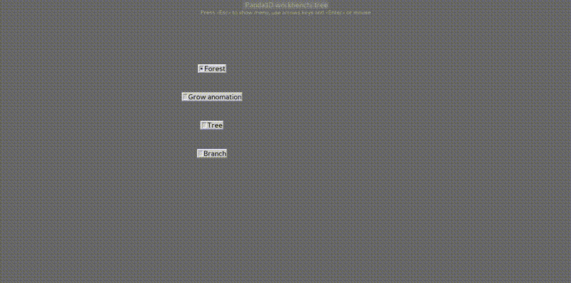

Panda3D Tree geometry generator
===============================

Just launch the demo:
```sh
python3 P3dTree.py
```

Example screen grab:



History
-------

* Improved on 14.04.2020 by Victoria D.

Introduced a new parametric object-oriented fractal generator.

Added demo of game environment with hundred unique trees. You can use resources/speed adaptation with ten unique trees types (for excample) and just copying it as `NodePath` to many locations. Also, selected trees from generated geometry can be saved and used while game time as having pretty-looking style.

* Created on 11.12.2010 by Jan Brohl

[🍕Buy me a Pizza](https://www.buymeacoffee.com/janbrohl>)

(First posted on http://www.panda3d.org/forums/viewtopic.php?f=8&t=10484 )

(Automatically exported from https://code.google.com/p/pandaplant )


* Quat-patch and improved drawBody by Craig Macomber
(see discussion on http://www.panda3d.org/forums/viewtopic.php?f=8&t=10484)

* Based on Kwasi Mensah's (kmensah@andrew.cmu.edu)
"The Fractal Plants Sample Program" from 8/05/2005

---

License: BSD-license
